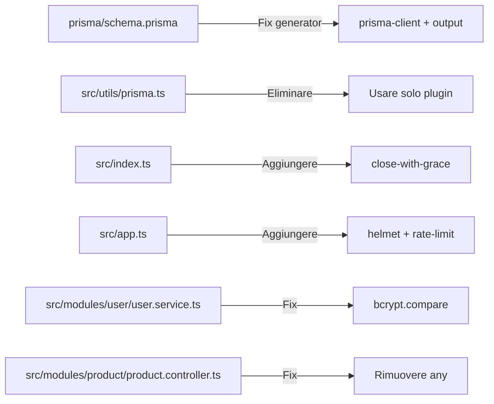

# 🔍 Server Audit Report

Analisi completa del progetto **fastify-prisma-zod-swagger v3.0.0** basata sulle best practices delle skill Fastify, Prisma v7 e Node.js.

---

## 📊 Panoramica

| Area | Stato |
|------|-------|
| Architettura | ✅ Solida |
| Type Safety | ⚠️ Parziale |
| Prisma v7 | ⚠️ Ibrida (v6/v7) |
| Sicurezza | ⚠️ Da migliorare |
| Testing | ✅ Buona copertura |
| Production Readiness | ⚠️ Parziale |
| Documentazione API | ✅ Buona |

---

## ✅ Cosa va bene

### 1. Architettura modulare
Il pattern **Route → Controller → Service** è solido e ben applicato. Ogni modulo (`user`, `product`) è autocontenuto con i propri schema, controller e service. L'aggregatore [routes.ts](file:///home/fabo/Documents/GitHub/fastify-prisma-zod-swagger/src/modules/routes.ts) mantiene pulito `app.ts`.

### 2. Validazione con Zod
L'integrazione di `fastify-type-provider-zod` è corretta. Gli schema Zod fungono da **single source of truth** per validazione, tipi TypeScript e documentazione Swagger. I tipi dei request body sono inferiti dagli schema (`z.infer<typeof ...>`), evitando duplicazione.

### 3. Error handling centralizzato
L'approccio in [error.handler.ts](file:///home/fabo/Documents/GitHub/fastify-prisma-zod-swagger/src/utils/error.handler.ts) è buono: gestisce errori Prisma specifici (`P2025`, `P2002`), errori di validazione custom, e fornisce un fallback 500 generico. In linea con le best practices Fastify sulla gestione errori.

### 4. Sicurezza nell'autenticazione
- La protezione contro **timing attacks** nel login ([user.service.ts:63](file:///home/fabo/Documents/GitHub/fastify-prisma-zod-swagger/src/modules/user/user.service.ts#L60-L64)) con il dummy hash è un'ottima pratica.
- Il JWT payload è fortemente tipizzato tramite `declare module "@fastify/jwt"`.
- Le password non vengono mai ritornate nelle risposte (uso di `select` nelle query Prisma).

### 5. Testing
- **30 test** che passano con buona copertura: unit test per i service (con mock), integration test per le route (con `server.inject`), e test del ciclo di vita del server.
- Uso corretto di `server.inject()` come raccomandato dalla skill Fastify testing.

### 6. Swagger/OpenAPI
- Schema registrati globalmente con `server.addSchema()` per la sezione Models.
- Security scheme `bearerAuth` configurato correttamente.
- Route tecniche nascoste con `hide: true`.

### 7. Configurazione ambiente
- Validazione env con Zod (`envSchema`) che fa crash-fast all'avvio se manca una variabile.
- Uso di `--env-file=.env` di Node.js nativo (niente `dotenv` a runtime).

---

## ⚠️ Cosa non va bene

### 1. 🔴 Prisma: configurazione ibrida v6/v7

> [!CAUTION]
> Il progetto è in uno stato **ibrido** tra Prisma v6 e v7. Questo funziona ora ma potrebbe rompersi nelle prossime minor.

| Aspetto | Stato attuale | Prisma v7 corretto |
|---------|---------------|---------------------|
| Generator provider | `prisma-client-js` ❌ | `prisma-client` |
| Output path | Default (node_modules) | Esplicito (`../generated`) |
| Importazioni | `@prisma/client` ❌ | Path esplicito dal generato |
| `prisma.config.ts` | ✅ Presente | ✅ OK |
| Driver adapter | ✅ `@prisma/adapter-pg` | ✅ OK |

**Problema**: Il generator `prisma-client-js` è il vecchio provider v6. Prisma v7 richiede `prisma-client` con un output esplicito. La ragione per cui funziona è che il pacchetto `@prisma/client` contiene ancora il codice legacy, ma questa compatibilità non è garantita nelle prossime release.

### 2. 🔴 Doppia istanza PrismaClient

> [!WARNING]
> Esistono **due istanze separate** di PrismaClient con due connection pool diversi:
> - [src/plugins/prisma.ts](file:///home/fabo/Documents/GitHub/fastify-prisma-zod-swagger/src/plugins/prisma.ts) — usata dal server via `server.prisma` (plugin)
> - [src/utils/prisma.ts](file:///home/fabo/Documents/GitHub/fastify-prisma-zod-swagger/src/utils/prisma.ts) — singleton **separato** usato nei test di integrazione

Questo significa **due pool di connessioni PostgreSQL**, spreco di risorse e potenziali inconsistenze. I test route importano da `utils/prisma.ts` per le operazioni di cleanup, mentre il server usa il plugin. Non condividono la stessa connessione.

### 3. 🔴 `any` nel product controller

In [product.controller.ts:22](file:///home/fabo/Documents/GitHub/fastify-prisma-zod-swagger/src/modules/product/product.controller.ts#L21-L23), `request` è tipizzato come `any`:

```typescript
export async function createProductHandler(
  request: any, // ← Perde tutta la type safety
  reply: FastifyReply
)
```

Questo vanifica il vantaggio del type provider Zod e può nascondere bug. Il controller user lo fa correttamente con `FastifyRequest<{ Body: CreateUserInput }>`.

### 4. 🟡 Nessun graceful shutdown

In [index.ts](file:///home/fabo/Documents/GitHub/fastify-prisma-zod-swagger/src/index.ts) manca completamente la gestione del graceful shutdown. Se il processo riceve `SIGTERM` (es. Docker stop, Kubernetes rolling update), le connessioni in-flight vengono interrotte bruscamente.

La skill Fastify deployment raccomanda `close-with-grace`:

```typescript
import closeWithGrace from 'close-with-grace';

closeWithGrace({ delay: 10000 }, async ({ signal, err }) => {
  await app.close();
});
```

### 5. 🟡 `process.exit(1)` nell'error handler

In [app.ts:159](file:///home/fabo/Documents/GitHub/fastify-prisma-zod-swagger/src/app.ts#L157-L160):

```typescript
} catch (_err) {
  server.log.error(_err, "Invalid environment configuration");
  process.exit(1); // ← Bypass di tutti gli hook onClose
}
```

`process.exit()` è un anti-pattern perché salta tutti gli hook `onClose` registrati (es. chiusura pool Prisma/pg). Meglio lanciare un errore e lasciare che il chiamante gestisca il fallimento.

### 6. 🟡 Nessun rate limiting

Non c'è alcun meccanismo di rate limiting. La skill Fastify security raccomanda `@fastify/rate-limit` con almeno una configurazione globale per proteggere da abusi, in particolare sugli endpoint di login e registrazione.

### 7. 🟡 Nessun security header

Manca `@fastify/helmet` per gli header di sicurezza HTTP standard (CSP, HSTS, X-Frame-Options, etc.). La skill Fastify cors-security lo raccomanda espressamente per qualsiasi API in produzione.

### 8. 🟡 CORS troppo permissivo

In [app.ts:181](file:///home/fabo/Documents/GitHub/fastify-prisma-zod-swagger/src/app.ts#L181):

```typescript
await server.register(cors, { origin: server.config.CORS_ORIGIN });
```

Accetta una singola stringa come origin. Non supporta origini multiple e non limita i metodi HTTP. La skill raccomanda una configurazione più dettagliata con `methods`, `allowedHeaders`, e `credentials`.

### 9. 🟡 `bcrypt.hash` usato per il confronto password

In [user.service.ts:68-69](file:///home/fabo/Documents/GitHub/fastify-prisma-zod-swagger/src/modules/user/user.service.ts#L67-L69):

```typescript
const hashedPassword = await bcrypt.hash(input.password, user.salt);
const isMatch = hashedPassword === user.password;
```

Si dovrebbe usare `bcrypt.compare()` che è **timing-safe** (constant-time comparison). Il confronto con `===` è vulnerabile a timing attacks.

---

## 🚀 Cosa si potrebbe migliorare/aggiungere

### Priorità Alta

| # | Miglioramento | Complessità | Impatto |
|---|---------------|-------------|---------|
| 1 | Migrare a generator `prisma-client` v7 con output esplicito | Media | Compatibilità futura |
| 2 | Eliminare la doppia istanza Prisma (`utils/prisma.ts`) | Bassa | Risorse, coerenza |
| 3 | Aggiungere `close-with-grace` per graceful shutdown | Bassa | Production readiness |
| 4 | Aggiungere `@fastify/rate-limit` | Bassa | Sicurezza |
| 5 | Aggiungere `@fastify/helmet` | Bassa | Sicurezza |
| 6 | Usare `bcrypt.compare()` invece di `hash + ===` | Bassa | Sicurezza critica |
| 7 | Rimuovere il cast `any` dal product controller | Bassa | Type safety |

### Priorità Media

| # | Miglioramento | Complessità | Impatto |
|---|---------------|-------------|---------|
| 8 | Aggiungere `@fastify/under-pressure` per load shedding | Bassa | Resilienza |
| 9 | Health check più ricco (`/health/ready` con DB check) | Bassa | Operabilità |
| 10 | Configurare log redaction per dati sensibili | Bassa | Sicurezza log |
| 11 | Aggiungere paginazione a `GET /product` | Media | Performance |
| 12 | Aggiungere `Dockerfile` multi-stage per il server | Media | Deployment |
| 13 | Aggiornare `docker-compose.yml` (rimuovere `version`, aggiungere healthcheck) | Bassa | Docker best practices |

### Priorità Bassa (Nice-to-have)

| # | Miglioramento | Complessità | Impatto |
|---|---------------|-------------|---------|
| 14 | Aggiungere `GET /product/:id` e `PUT /product/:id` | Media | Feature completeness |
| 15 | Aggiungere `@fastify/compress` per compressione risposte | Bassa | Performance |
| 16 | Usare il `prisma.config.ts` anche per il `seed` (non solo in `package.json`) | Bassa | Coerenza config |
| 17 | Configurare `trustProxy` per ambienti con reverse proxy | Bassa | Deployment |
| 18 | Eliminare `tsc-alias` dalle devDependencies (non usato) | Bassa | Pulizia |
| 19 | Aggiungere keywords al `package.json` | Bassa | Discoverability |

---

## 📁 File da modificare per le fix critiche



---

## 🏁 Conclusione

Il progetto ha una **buona base architetturale** con pattern moderni (Zod schemas, type provider, plugin system). I punti deboli principali sono nella **configurazione Prisma ibrida v6/v7**, nella **sicurezza** (mancano rate limiting, helmet, e il confronto password non è timing-safe), e nella **production readiness** (manca graceful shutdown). Tutti i fix sono a complessità bassa-media e non richiedono refactoring strutturali.
